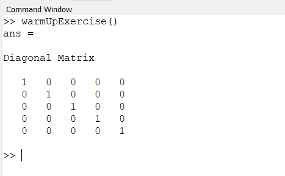
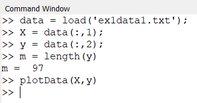
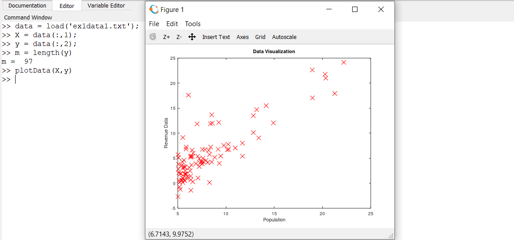
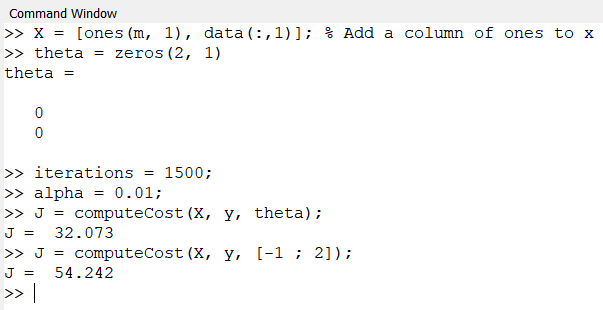
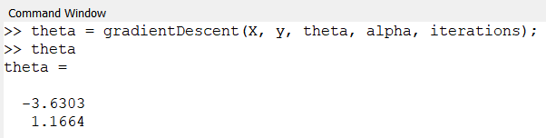
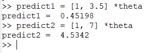
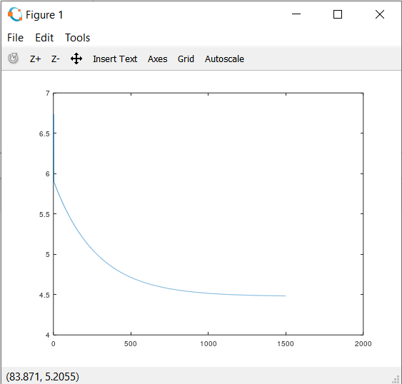

# Exercise 1 - Code Execution

## Warm Up Exercise
</img>

## Load and Plot Data
</img>

## Plot Figure
</img>

## Computing Cost
</img>

## Gradient Descent
</img>

## Prediction
</img>

## PLotting of model
</img>

## J vs Iterations
</img>

